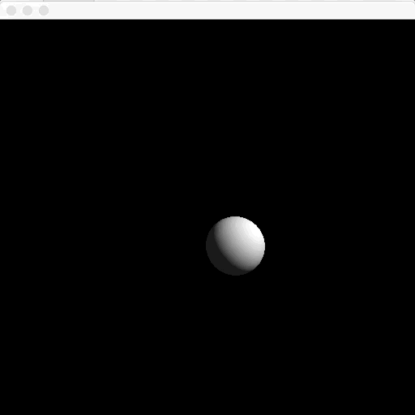

# Ray tracing in Scala

Ray tracing and create a .png image file.

## Main features

* Use only Java/Scala Standard libraries (AWT/Swing)
* Ray tracing on image-creation base (`java.awt.image.BufferedImage`)


## How to run

```bash
cd <this repo>
sbt run
```

Then you will have a window

## Demo




## References

* https://qiita.com/doxas/items/477fda867da467116f8d