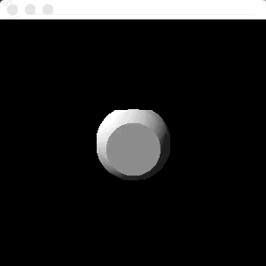

# Ray tracing in Scala

Ray tracing and create a .png image file.

## Main features

* No 3D graphic library (Use only Java/Scala standard library)
* Ray tracing on image-creation base (`java.awt.image.BufferedImage`)


## How to run

### Saving as an image

```bash
cd <this repo>
sbt "runMain SavePngMain"
```

Then you will get `<this repo>/images/output.png`

### Animation of ray tracing

```bash
cd <this repo>
sbt "runMain AnimationMain"
```

Then you will have a window

or 

```bash
cd <this repo>
sbt "runMain SphereRayTracingMain"
```

Then you will have a window


## Source codes

### Entry points

* [src/main/scala/SavePngMain.scala](src/main/scala/SavePngMain.scala)
* [src/main/scala/AnimationMain.scala](src/main/scala/AnimationMain.scala)
* [src/main/scala/SphereRayTracingMain.scala](src/main/scala/SphereRayTracingMain.scala) (using distance function)

### Main part of ray tracing

* [src/main/scala/RayTracing.scala](src/main/scala/RayTracing.scala)

## Demo of AnimationMain


## Demo of SphereRayTracingMain



## References

* https://qiita.com/doxas/items/477fda867da467116f8d